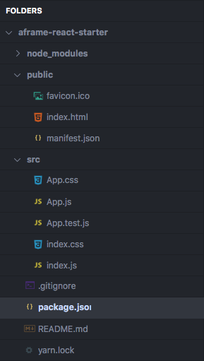
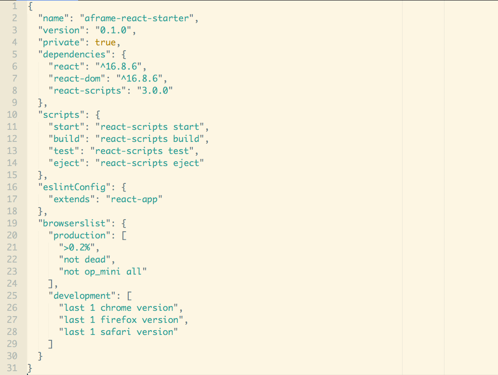
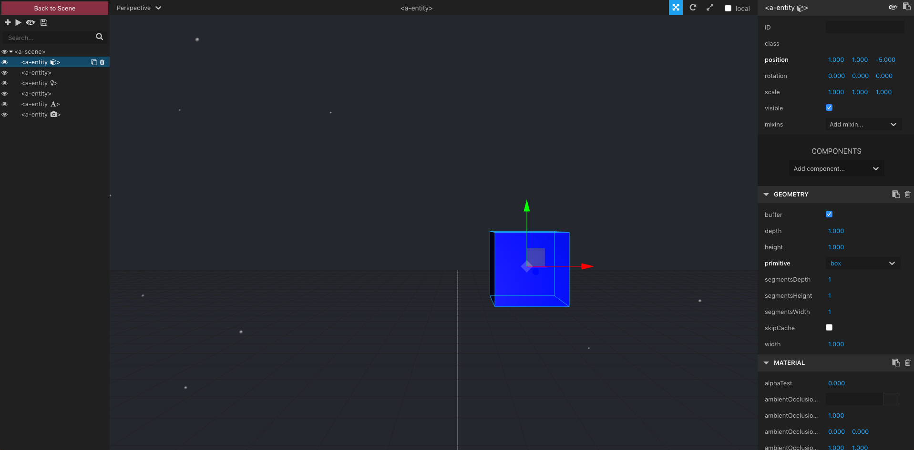

# A-Frame && React Starter

## React Setup

Create a directory to initialize the project. The following code creates a new directory to store the app you're about to write, then cd into the folder.

```bash
$ create-react-app aframe-react-starter # creates your new app
$ cd aframe-react-starter # navigate into the directory
```

The project folder structure should look like the following:



Inside the `package.json` file, you will see several **scripts** have been provided that allows you to run several commands from Terminal:



You will also see that several dependencies have been installed: react, react-dom and react-scripts. Use `yarn start` to start a server that will serve the React application. This opens the app at `http://localhost:3000`.

The browser should now display the words "Hello World!"

Now, open this project in your favorite code editor and modify the App Component to reflect the following changes in the `return()`.

```js
import React, { Component } from 'react';
import './App.css';

class App extends Component {
  return (
    <div className="App">Hello World</div>
  );
}

export default App;
```

## A-Frame Setup

Now, we are going to install two dependencies for A-Frame into our application:
 - [aframe-react](https://www.npmjs.com/package/aframe-react)
 - [aframe](https://www.npmjs.com/package/aframe)
 - [aframe-particle-system-component](https://www.npmjs.com/package/aframe-particle-system-component)

```bash
$ npm install aframe aframe-react aframe-particle-system-component
$ yarn add aframe aframe-react aframe-particle-system-component
```


Then, import it into the App component.

```js
import React, { Component } from 'react';
import 'aframe';
import 'aframe-particle-system-component';
import { Entity, Scene } from 'aframe-react';

class App extends Component {
  render(){
      return (
        <Scene>
          <Entity
            geometry={{primitive: 'box'}}
            material={{color: 'blue'}}
            position={{x: 0, y: 0, z: -5}}/>
          <Entity
            particle-system={{preset: 'snow'}}
            position='0 2.25 -15' />
          <Entity light={{type: 'point'}}/>
          <Entity gltf-model={{src: 'virtualcity.gltf'}}/>
          <Entity text={{value: 'Hello, WebVR!'}}/>
        </Scene>
      );
  }
}

export default App;
```

## A-Frame Dev Tools & Visual Inspector

Now it's time to explore our world using the dev tools and visual inspector. A-Frame provides a visual tool -- [A-Frame Inspector](https://aframe.io/docs/0.9.0/introduction/visual-inspector-and-dev-tools.html) -- for inspecting and tweaking scenes.

With your browser active, go ahead hit the following keys together: `<ctrl> + <alt> + i`. This will open the visual inspector and dev tools. On the left side of the screen you will see the scene graph with all of the components we just created.

The Inspector is similar to the browser’s DOM inspector but tailored for 3D and A-Frame.



### Using the Inspector

##### Scene Graph

The scene graph (left panel) is a tree-based representation of the scene.

##### Viewport

The viewport (center panel) displays the scene from the Inspector’s point of the view. We can rotate, pan, or zoom the viewport to change the view of the scene. You can also click on entities to select them and transform their properties.

##### Components Panel

The components panel (right panel) displays the selected entity’s components and properties. 

## Learn More

You can learn more in the [Create React App documentation](https://facebook.github.io/create-react-app/docs/getting-started).

To learn React, check out the [React documentation](https://reactjs.org/).
